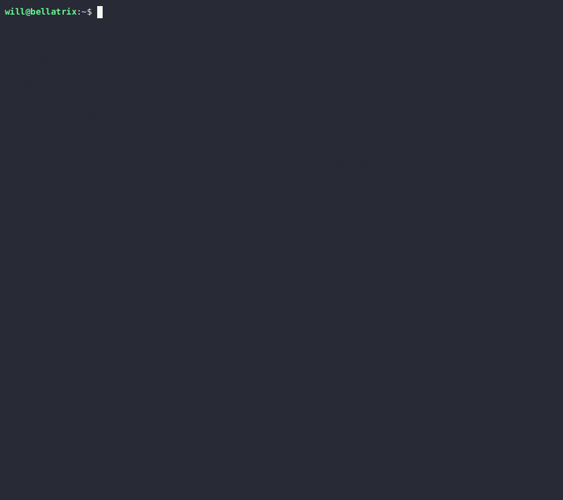

# oha-docker

[](https://github.com/ahmadalsajid/oha-docker/actions/workflows/actions.yml/badge.svg?branch=main)

Minimal, Multi-arch, lightweight docker image of [OHA](https://github.com/hatoo/oha), 
inspired by [rakyll/hey](https://github.com/rakyll/hey),

Oha is written in Rust and powered by [tokio](https://github.com/tokio-rs/tokio)
and beautiful tui by [ratatui](https://github.com/ratatui-org/ratatui).



## Installation

```
$ docker pull ahmadalsajid/oha-docker
```

## Usage

hey runs provided number of requests in the provided concurrency level and
prints stats. A basic usage could be

```
$ docker run --rm -it ahmadalsajid/oha-docker -n 1000 -c 100 https://google.com
```

`-q` option works different from [rakyll/hey](https://github.com/rakyll/hey). It's set overall query per second instead of
for each worker.

```bash
Options:
  -n <N_REQUESTS>                     Number of requests to run. [default: 200]
  -c <N_CONNECTIONS>                  Number of connections to run concurrently. You may should increase limit to number of open files for larger `-c`. [default: 50]
  -p <N_HTTP2_PARALLEL>               Number of parallel requests to send on HTTP/2. `oha` will run c * p concurrent workers in total. [default: 1]
  -z <DURATION>                       Duration of application to send requests. If duration is specified, n is ignored.
                                      When the duration is reached, ongoing requests are aborted and counted as "aborted due to deadline"
                                      Examples: -z 10s -z 3m.
  -q <QUERY_PER_SECOND>               Rate limit for all, in queries per second (QPS)
      --burst-delay <BURST_DURATION>  Introduce delay between a predefined number of requests.
                                      Note: If qps is specified, burst will be ignored
      --burst-rate <BURST_REQUESTS>   Rates of requests for burst. Default is 1
                                      Note: If qps is specified, burst will be ignored
      --rand-regex-url                Generate URL by rand_regex crate but dot is disabled for each query e.g. http://127.0.0.1/[a-z][a-z][0-9]. Currently dynamic scheme, host and port with keep-alive are not works well. See https://docs.rs/rand_regex/latest/rand_regex/struct.Regex.html for details of syntax.
      --max-repeat <MAX_REPEAT>       A parameter for the '--rand-regex-url'. The max_repeat parameter gives the maximum extra repeat counts the x*, x+ and x{n,} operators will become. [default: 4]
      --latency-correction            Correct latency to avoid coordinated omission problem. It's ignored if -q is not set.
      --no-tui                        No realtime tui
  -j, --json                          Print results as JSON
      --fps <FPS>                     Frame per second for tui. [default: 16]
  -m, --method <METHOD>               HTTP method [default: GET]
  -H <HEADERS>                        Custom HTTP header. Examples: -H "foo: bar"
  -t <TIMEOUT>                        Timeout for each request. Default to infinite.
  -A <ACCEPT_HEADER>                  HTTP Accept Header.
  -d <BODY_STRING>                    HTTP request body.
  -D <BODY_PATH>                      HTTP request body from file.
  -T <CONTENT_TYPE>                   Content-Type.
  -a <BASIC_AUTH>                     Basic authentication, username:password
      --http-version <HTTP_VERSION>   HTTP version. Available values 0.9, 1.0, 1.1.
      --http2                         Use HTTP/2. Shorthand for --http-version=2
      --host <HOST>                   HTTP Host header
      --disable-compression           Disable compression.
  -r, --redirect <REDIRECT>           Limit for number of Redirect. Set 0 for no redirection. Redirection isn't supported for HTTP/2. [default: 10]
      --disable-keepalive             Disable keep-alive, prevents re-use of TCP connections between different HTTP requests. This isn't supported for HTTP/2.
      --no-pre-lookup                 *Not* perform a DNS lookup at beginning to cache it
      --ipv6                          Lookup only ipv6.
      --ipv4                          Lookup only ipv4.
      --insecure                      Accept invalid certs.
      --connect-to <CONNECT_TO>       Override DNS resolution and default port numbers with strings like 'example.org:443:localhost:8443'
      --disable-color                 Disable the color scheme.
      --unix-socket <UNIX_SOCKET>     Connect to a unix socket instead of the domain in the URL. Only for non-HTTPS URLs.
      --vsock-addr <VSOCK_ADDR>       Connect to a VSOCK socket using 'cid:port' instead of the domain in the URL. Only for non-HTTPS URLs.
      --stats-success-breakdown       Include a response status code successful or not successful breakdown for the time histogram and distribution statistics
  -h, --help                          Print help
  -V, --version                       Print version
```

## JSON output

`oha` prints JSON output when `-j` option is set.
The schema of JSON output is defined in [schema.json](https://github.com/hatoo/oha/blob/master/schema.json).

